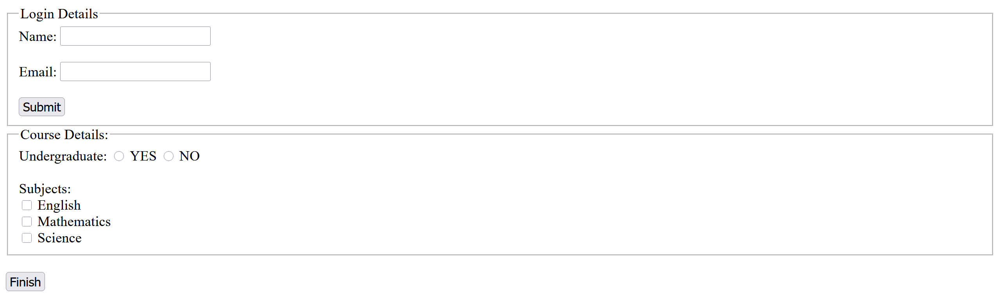
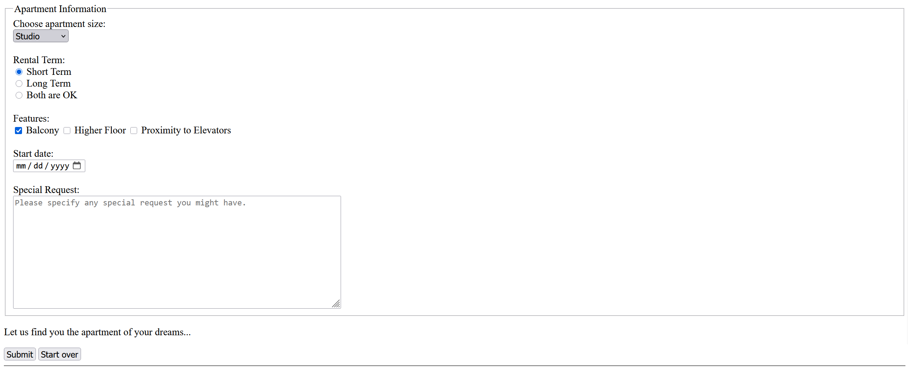
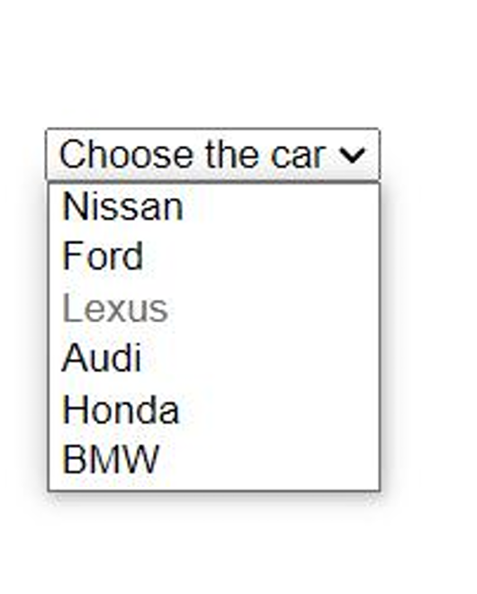
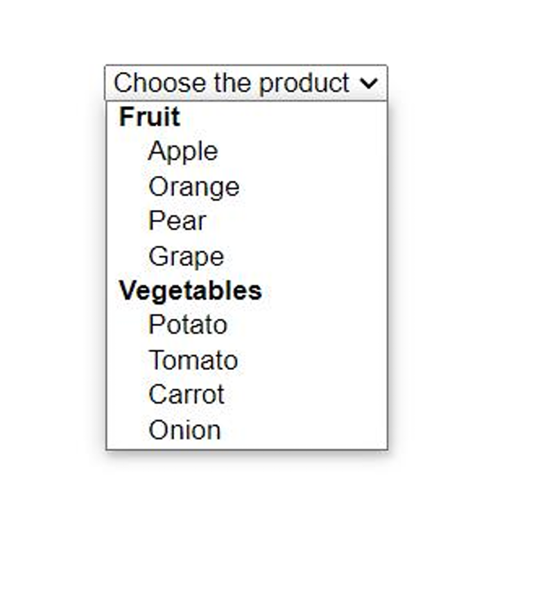

# 📝 Lab 03: Mastering HTML Forms & Input Validations

## 🎯 Overview
This lab focuses on the interactive part of web development: **HTML Forms**.
The goal was to build multiple data collection interfaces (Login, Registration, Rental Search, and Product Selection) while strictly adhering to semantic HTML structure. Special attention was paid to attribute usage and structural preparation for future CSS styling.

## 📂 What's Inside?
This lab contains 4 distinct form sections implemented in `index.html`:
1.  **Login & Course Registration:** Text inputs and radio/checkbox groups.
2.  **Apartment Search:** Complex inputs including Date pickers, Textareas, and Dropdowns.
3.  **Car Selection:** A dropdown with a specific "disabled" option scenario.
4.  **Product Market:** A grouped dropdown list using `<optgroup>`.

---
## 📸 Tasks's Final view 

### 1. Login & Course Details


### 2. Apartment Information


### 3. Car Selection


### 4. Product Selection


## 🏗️ Technical Breakdown (The "Tutorial" Part)

Here is a detailed explanation of the tags and attributes used in this lab, serving as a reference for future development.

### 1. Essential Form Elements
| Tag | Usage in Code | Why use it? |
| :--- | :--- | :--- |
| `<form>` | Wraps every section | The container for all inputs. Defines *where* data goes (`action`) and *how* (`method`). |
| `<fieldset>` | `<fieldset class="course-group">` | Groups related data (like "Course Details") logically and visually. |
| `<legend>` | `<legend>Login Details</legend>` | Provides a caption/title for the `<fieldset>` border. |
| `<label>` | `<label for="email">` | Critical for accessibility. Clicking the text activates the input. Linked via `for` attribute. |

### 2. Input Types & Attributes
Different data requires different input types. Here is what I implemented:

* **Text & Email (`type="text/email"`):** Standard inputs. `type="email"` automatically validates for "@" symbol.
* **Radio Buttons (`type="radio"`):** Used for "Yes/No" or "Rental Term".
    * *Note:* The `name` attribute must be the same for all buttons in a group (e.g., `name="term"`) to ensure only **one** option can be selected.
* **Checkboxes (`type="checkbox"`):** Used for "Subjects" and "Features". Allows multiple selections.
* **Date Picker (`type="date"`):** Provides a built-in calendar for "Start date".
* **Textarea (`<textarea>`):** Used for "Special Request". Unlike input, this allows multi-line text.
    * *Attributes:* `rows="11"` and `cols="70"` define the initial size.

### 3. Advanced Selection Menus (`<select>`)
I implemented three variations of dropdown menus:
1.  **Standard:** Simple selection (Apartment size).
2.  **With Disabled Option:** In the Car form, "Lexus" is visible but unclickable (`disabled` attribute) to simulate out-of-stock items.
3.  **Grouped Options:** In the Product form, `<optgroup label="Fruit">` is used to categorize options, making the list easier to read.

---

## 🎨 Preparing for CSS: The "Box" Strategy

Although this lab is pure HTML, I structured the code to make future CSS styling easier.

**Key Strategy: Wrapper Divs**
Instead of leaving inputs floating, I wrapped label+input pairs in `<div>` containers with specific classes:

```html
<div class="form-row">
    <label for="apt-size">Choose apartment size:</label>
    <select id="apt-size" name="size">...</select>
</div>